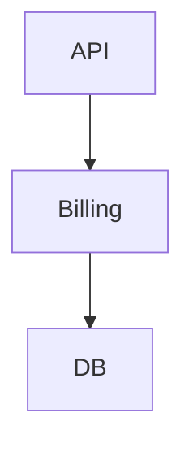

# Architecture Operating System — ArchSpec — Mental Model

### Managing Multi-Source Input → Decisions → System Knowledge

---

## 🎯 Purpose

Modern Solution Architects don’t suffer from lack of tools — they suffer from **fragmented input and untraceable decisions**.

This document defines a **lightweight, Git-native Architecture Operating System — ArchSpec** that:

Collects → Normalizes → Links → Decides → Shares

Built entirely on:

* **Markdown (MD)** → human-readable decisions
* **YAML** → machine-readable structure
* **CLI + Git** → automation + governance

---

## 🧠 Core Principles

### 1. Architecture = Information Flow

Not diagrams. Not tools.
It is how information moves and becomes decisions.

---

### 2. Everything is Linkable

Problem → Service → Constraint → Decision → Impact

If it’s not linked → it doesn’t exist.

---

### 3. Git is the Source of Truth

* Versioned decisions
* Reviewable architecture
* Auditable evolution

---

### 4. Delay Tools, Maximize Structure

Start simple:

MD + YAML > Any Enterprise Tool

---

## 🏗️ System Overview

```
INPUT (Slack, Jira, Docs, Meetings)
        ↓
INBOX (MD + YAML)
        ↓
KNOWLEDGE GRAPH (CLI / Index)
        ↓
DECISIONS (ADR - Markdown)
        ↓
STRUCTURE (YAML system model)
        ↓
OUTPUT (Docs / Mermaid / AI)
```

---

## 📨 1. INPUT LAYER (Architecture Inbox)

### Problem

Inputs come from:

* Slack discussions
* Jira / GitHub issues
* Meetings
* Personal notes

They are unstructured and easily lost.

---

### Solution: Normalize into YAML

```yaml
id: PROB-001
title: API latency spike
source: slack
type: performance
created_at: 2026-04-04

services:
  - api-gateway
  - billing

symptoms:
  - p95 latency > 2s
  - timeout errors

constraints:
  - cannot scale DB vertically

tags:
  - urgent
  - production
```

---

### Storage

```
/architecture/inbox/
  PROB-001.yaml
  PROB-002.yaml
```

---

### Rule

No decision without Inbox entry.

---

## 🧠 2. KNOWLEDGE GRAPH (Context Engine)

### Goal

Turn raw inputs into connected system knowledge.

---

### Graph Model

```
[Problem] → [Service] → [Constraint]
           ↓
       [Decision]
           ↓
        [Impact]
```

---

### Example Queries

* Which problems affect billing service?
* Which decisions were made due to latency issues?

---

### Outcome

Architecture becomes **queryable**, not just readable.

---

## ⚖️ 3. DECISION LAYER (ADR)

### Format

```md
# ADR-012: Introduce Caching Layer

## Context
- PROB-001 (API latency spike)
- PROB-003 (high DB load)

## Decision
Introduce Redis caching at API layer

## Alternatives
- Scale DB (rejected: cost)
- Optimize queries (partial)

## Consequences
+ Reduce latency by ~60%
- Cache invalidation complexity

## Affected Services
- api-gateway
- billing
```

---

### Storage

```
/architecture/adr/
  ADR-012-caching.md
```

---

### Rule

Every decision MUST link to:

* at least 1 problem
* affected services

---

## 🏗️ 4. SYSTEM STRUCTURE (YAML)

### Purpose

Define system topology and dependencies.

---

### Example

```yaml
services:
  api-gateway:
    depends_on:
      - auth
      - billing

  billing:
    depends_on:
      - database

  database:
    type: postgres
```

---

### Storage

```
/architecture/model/services.yaml
```

---

### Rule

If architecture changes → YAML must change.

---

## 📊 5. VISUALIZATION

### Default: Mermaid



---

### Rule

Diagram = projection of system
NOT source of truth.

---

## 📢 6. OUTPUT / SHARING

### For Engineers

* Markdown + Mermaid in repo
* PR-based review

### For Stakeholders

* Simplified summaries
* High-level diagrams

### For AI

* Queryable architecture (via indexing)

---

## 🔁 END-TO-END FLOW

```
Slack / Jira / Meeting
        ↓
Inbox (YAML)
        ↓
Knowledge Graph
        ↓
ADR (Decision)
        ↓
System YAML update
        ↓
Docs / Diagram / AI
```

---

## ⚙️ AUTOMATION

### CI Checks

* YAML validation
* ADR format validation
* Broken links detection

---

### Optional Enhancements

* Auto-link problems ↔ ADR
* Generate Mermaid from YAML
* AI query interface

---

## 🚫 Anti-Patterns

* Decisions in Slack only
* Diagrams without data
* Docs not updated with code
* Big design upfront without traceability
* Tool-heavy architecture too early

---

## 🧠 Final Insight

A great architect does NOT produce diagrams

A great architect builds a SYSTEM where:

* problems are captured
* decisions are traceable
* knowledge is reusable

---

## 🚀 Adoption Strategy

### Phase 1

* Setup folder structure
* Start Inbox + ADR

### Phase 2

* Add YAML system model
* Enforce PR updates

### Phase 3

* Add knowledge graph
* Enable AI querying

---

## 🏁 Final Thought

Architecture maturity is measured by:

* clarity of decisions
* traceability of impact
* ability to evolve safely
