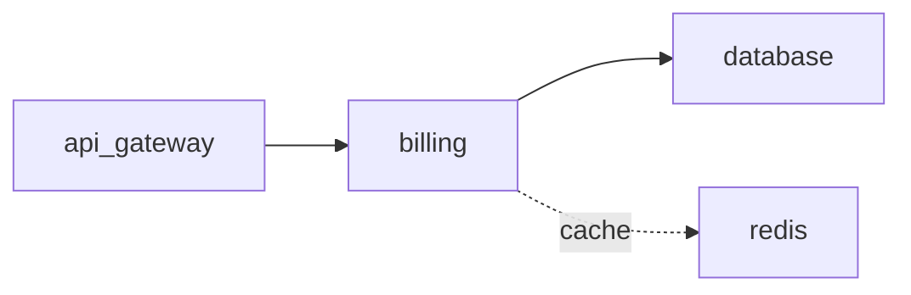

# ADR-001: Cache billing reads in Redis

## Metadata
- status: superseded
- date: 2026-01-20
- superseded_by: ADR-006
- links: [PROB-001]
- labels: area=payments, criticality=core

## Context

The billing monolith showed p95 latency > 2s under peak load (PROB-001) because it re-read the
same account/plan rows from the shared database on every request.

## Decision

Put a Redis cache in front of billing's hot reads, with a short TTL and write-through on
updates. A targeted fix for the read hot-spot on the existing monolith.

## Diagram

## Alternatives

- Vertically scale the shared database — rejected (constraint: already at the ceiling).
- Read replicas — deferred (adds replication lag to billing reads).

## Consequences

Read latency drops sharply; cache invalidation on updates must be handled carefully. This kept
the monolith alive but didn't address the deeper coupling — superseded by the decomposition in
ADR-006.

## Affected Services
- billing
- database
