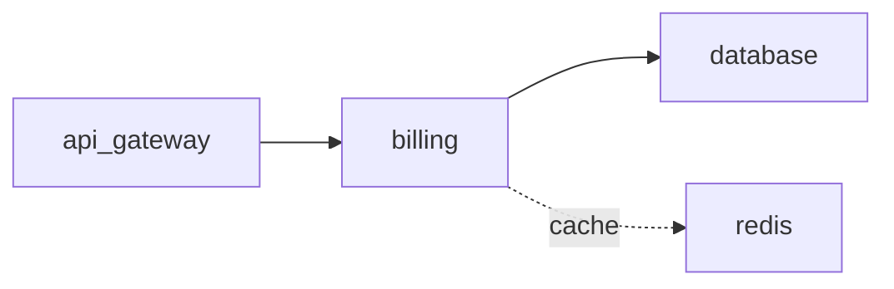

# ADR-001: Cache billing reads in Redis

## Metadata
- status: accepted
- date: 2026-04-06
- superseded_by: ~
- links: [PROB-001]
- labels: area=payments, criticality=core

## Context

`billing` reads hit the database on every checkout, driving p95 latency above 2s
under load (see PROB-001).

## Decision

Introduce a Redis cache in front of `billing` reads.

```yaml
cache:
  ttl: 60s
  backend: redis
```

## Alternatives

- Vertical DB scaling — rejected (constraint: cannot scale DB vertically).

## Consequences

Lower read latency; cache invalidation must be handled on writes.

## Diagram



## Affected Services
- billing
