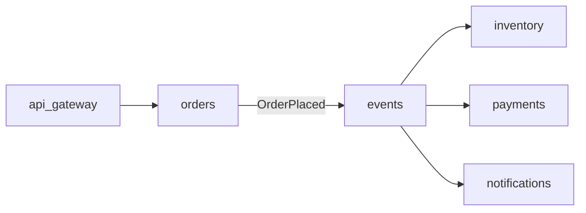

# ADR-006: Decompose the billing monolith and shared database

## Metadata
- status: accepted
- date: 2026-05-10
- superseded_by: ~
- links: [PROB-001, PROB-007]
- labels: area=payments, criticality=core

## Context

Caching kept the billing monolith alive (ADR-001), but every new domain still had to extend it,
and the shared database became a single point of contention (PROB-007). The read hot-spot was a
symptom of deeper coupling.

## Decision

Decompose the monolith into bounded services — `payments` (with its own `payments-db`), and the
order flow into `orders`/`inventory` with per-service databases — coordinated through domain
events on `events` rather than shared tables. Retire `billing` and the shared `database` once
traffic is migrated. Supersedes the ADR-001 caching approach.

## Diagram

## Alternatives

- Keep caching the monolith (ADR-001) — rejected (doesn't address coupling or ownership).
- Split the database only, keep one service — rejected (still a single deploy/ownership unit).

## Consequences

Domains evolve and scale independently with clear ownership; `billing`/`database` remain in the
record as `retired` for traceability. The team takes on event-schema versioning, idempotent
consumers, and an incremental migration (constraint).

## Affected Services
- payments
- orders
- inventory
- events
