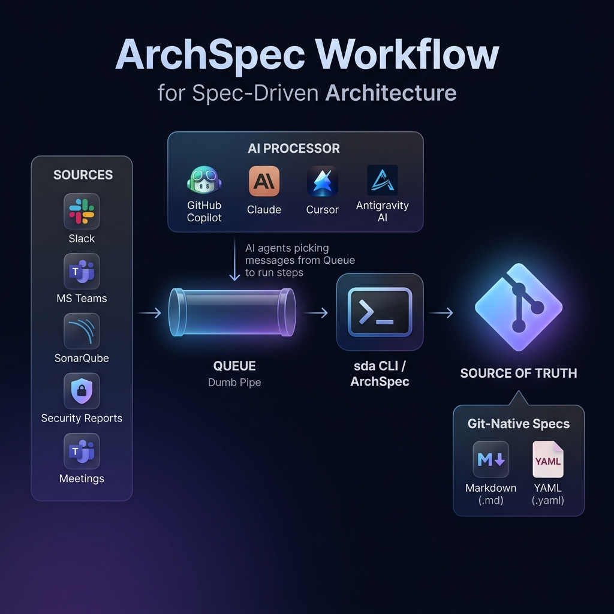

<p align="center">
  <strong>ArchSpec</strong><br>
  <em>The lightweight, Git-native framework for Spec-Driven Architecture (SDA).</em>
</p>

<p align="center">
  <a href="https://github.com/TamVoMinh/archspec/actions"></a>
  
  
</p>

---

## A familiar week

If you do architecture work, some of this probably sounds familiar:

```
  Slack thread  — "should we use Redis for sessions?"
  Meeting       — "we agreed on option B" (nobody wrote it down)
  SonarQube     — 3 architecture-level findings from last night's scan
  QC report     — security concern in the auth token flow
  Incident      — same root cause as six months ago
```

We all deal with this. Architecture signal comes in all day from every direction — Slack, meetings, code scans, QC reviews, incidents. Most of it never gets captured. Not because we don't care, but because there's no fast, low-friction place to put it. By Friday, we remember maybe one of the three things we noticed on Tuesday.

ArchSpec is how we solved that for ourselves. We're sharing it because it might help you too.

---

## How it works

We didn't build a platform. We didn't want another service to operate. When we looked at the problem honestly, we realized three things:

### The architect is the router — and human memory is the worst database ever built

Every Slack thread, every SonarQube finding, every meeting decision, every QC report — it all flows through one person's brain. That brain is overloaded, context-switching, and lossy. The signal isn't being ignored. It's being lost in transit.

### We don't need a new system. We need a dumb pipe.

The cheapest way to stop losing signal is not a better memory. It's a dumber pipe. A Slack channel called `#arch-inbox`. A shared mailbox. A webhook endpoint. Something that is always on, accepts input from anything, and holds messages until they're processed. It doesn't need to understand architecture. It just needs to not forget.

Most of us already have one of these. We just haven't pointed it at our architecture practice.

### Any AI agent can be the processor. The toolkit stays the same.

On the other side of that pipe, an AI agent reads the message, runs `sda capture`, and opens a PR. Copilot, Claude, Cursor — anything with MCP or shell access. The agent is disposable and replaceable. The queue and the CLI are not. That's the whole trick: **three decoupled layers, each independently replaceable.**



Nothing here is new infrastructure. The sources already exist. The queue probably already exists. ArchSpec is just the CLI toolkit that turns that signal into structured, traceable, Git-native architecture records.

> [!TIP]
> **Want to try it?** Run `sda init` in any repo, then follow [Getting Started](docs/guides/getting-started.md). First problem captured and ADR open in under 10 minutes.

---

## See it in action

Say a SonarQube scan found a circular dependency, the QC team flagged a security concern, and someone mentioned a timeout in Slack — all in the same week:

```text
$ sda capture "Circular dependency: billing → auth" --source sonarqube --type design
╭─────────────────────────── PROB-001 ───────────────────────────╮
│ Created: architecture/inbox/PROB-001.yaml                      │
│ Next: fill in services and symptoms, set status → active       │
╰────────────────────────────────────────────────────────────────╯

$ sda capture "Auth tokens stored without rotation policy" --source security-audit
╭─────────────────────────── PROB-002 ───────────────────────────╮
│ Created: architecture/inbox/PROB-002.yaml                      │
╰────────────────────────────────────────────────────────────────╯

$ sda capture "Checkout times out under load" --source slack --type performance
╭─────────────────────────── PROB-003 ───────────────────────────╮
│ Created: architecture/inbox/PROB-003.yaml                      │
╰────────────────────────────────────────────────────────────────╯

$ sda check
✓ No errors   3 warning(s)
  ⚠ PROB-001 is draft — triage within 48h (SLA: 48h)
  ⚠ PROB-002 is draft — triage within 48h (SLA: 48h)
  ⚠ PROB-003 is draft — triage within 48h (SLA: 48h)
```

After triage and decision-making:

```text
$ sda index
Generated architecture/index.yaml
5 nodes — PROB-001 → ADR-001 → [billing, auth]
          PROB-003 → ADR-002 → [api-gateway, billing]

$ sda status
╭──────────────────── ArchSpec Status ───────────────────────╮
│  Problems   3 total   2 active   1 draft                    │
│  ADRs       2 total   2 accepted   0 proposed               │
│  Services   4 total   none stale                            │
│  Index      fresh (today)                                   │
╰────────────────────────────────────────────────────────────╯
```

Three sources — SonarQube, a security audit, a Slack thread — all normalized into the same traceable format. Nothing lost. Everything linked. Git is the record.

---

## The discipline behind it

We think of this like TDD but for architecture. In TDD, tests drive the code. In **Spec-Driven Architecture (SDA)**, decision specs drive the system.

```
→ no decision without a problem    — we can always trace back why
→ no implementation without a spec — ADRs come before engineering
→ Git is the database              — no servers, no dashboards
→ Markdown + YAML                  — readable by humans and AI alike
→ solo or team                     — same discipline, same system
```

Every engineering change has a problem behind it. Every problem has a decision. Every decision has consequences. SDA makes that chain explicit and enforceable — so the reasoning doesn't live in one person's head.

---

## Why we built this

Architecture work generates constant signal — Slack threads, incident retros, Jira tickets, SonarQube scans, QC reports, hallway conversations. Without a **capture discipline**, that signal evaporates. Without an **ADR practice**, decisions become tribal knowledge. Without a **knowledge graph**, nobody can answer *"what services are affected by this change?"*

We wanted one Git-native place where all three live together, enforce each other, and stay queryable. That's what ArchSpec is.

→ **[Read the full story](why-archspec.md)** — the longer version of why we think the status quo costs more than it looks.

<details>
<summary><strong>How it compares</strong></summary>

**vs. a wiki** — Write-once, never queried, no lifecycle enforcement. ArchSpec files are structured, versioned, and machine-checkable.

**vs. Confluence ADR pages** — No CI integration, no cross-linking, no staleness detection. ArchSpec checks run on every push.

**vs. building a platform** — We didn't want a service to operate. ArchSpec is a CLI toolkit. The queue is whatever you already have — a Slack channel, a mailbox, a webhook.

**vs. OpenSpec** — OpenSpec drives feature development (SDD). ArchSpec drives system architecture (SDA). Different scope, same philosophy.

**vs. nothing** — Decisions become folklore. Six months later, nobody remembers why the system is shaped the way it is.

</details>

---

## Quick Start

```bash
pip install sda-cli
cd your-repo
sda init
```

`sda init` scaffolds the full structure — inbox, ADR template, service model, OWNERS.yaml, and a ready-to-use GitHub Actions CI workflow.

---

## CLI Reference

| Command | What it does |
|---|---|
| `sda init` | Scaffold a new SDA project from templates |
| `sda capture "title"` | Create a draft problem in `architecture/inbox/` |
| `sda check [--strict]` | Validate ADR lifecycle, staleness, and ownership |
| `sda index [--validate]` | Generate or validate `architecture/index.yaml` |
| `sda status` | Health overview — problems, ADRs, services, index age |

---

## Docs

→ **[Getting Started](docs/guides/getting-started.md)** — first steps in 10 minutes<br>
→ **[Your First ADR](docs/guides/first-adr.md)** — step-by-step walkthrough<br>
→ **[Multi-Team Setup](docs/guides/multi-team.md)** — domain ownership and conflict resolution<br>
→ **[Problems](docs/concepts/problems.md)** — inbox schema and triage lifecycle<br>
→ **[Decisions](docs/concepts/decisions.md)** — ADR format, state machine, PR labels<br>
→ **[Knowledge Graph](docs/concepts/knowledge-graph.md)** — querying architecture with `yq`<br>
→ **[Governance](docs/concepts/governance.md)** — OWNERS.yaml, CODEOWNERS, review policy<br>
→ **[Integration](docs/concepts/integration.md)** — connecting Slack, SonarQube, CI, and AI agents<br>
→ **[Mental Model](docs/mental-model.md)** — the philosophy behind SDA<br>

---

## License

MIT
